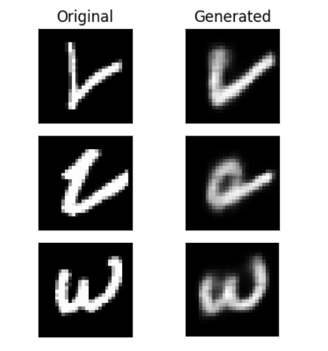

# Variational Autoencoder (VAE) on MNIST with PyTorch

This repository contains a Jupyter notebook that demonstrates the implementation of a Variational Autoencoder (VAE) using PyTorch, applied to the MNIST dataset of handwritten digits. The project explores the potential of VAEs in generating grayscale images of numerical digits and delves into their ability to model complex data distributions.

## Table of Contents

- [Introduction](#introduction)
- [Getting Started](#getting-started)
- [Notebook Overview](#notebook-overview)
- [Results](#results)

## Introduction

Variational Autoencoders (VAEs) are powerful generative models that merge deep learning with probabilistic reasoning. In this project, we utilize a VAE to generate realistic grayscale images of handwritten digits from the MNIST dataset. The notebook walks through the steps of building, training, and evaluating the VAE model using PyTorch.

## Getting Started

To get started with this project, you'll need to have Python installed along with Jupyter Notebook and the required Python packages.

### Prerequisites

Make sure you have the following packages installed:

- `torch`
- `torchvision`
- `matplotlib`
- `numpy`
- `jupyter`

You can install these packages using `pip`:

```bash
pip install torch torchvision matplotlib numpy jupyter
```

## Notebook Overview

The notebook is structured as follows:

1. **Setup:** 
    - Importing necessary libraries and setting up the environment.

2. **Data Loading and Preprocessing:** 
    - Loading the MNIST dataset using `torchvision`.
    - Preprocessing the data, including normalization and conversion to PyTorch tensors.

3. **Model Architecture:** 
    - Definition of the VAE model, including the encoder, decoder, and the reparameterization trick.
    - Explanation of the architecture and the forward pass.

4. **Training:** 
    - Setting up the training loop with the appropriate loss function (combination of reconstruction loss and KL divergence).
    - Training the VAE on the MNIST dataset and monitoring the training process.

5. **Results:** 
    - Visualizing the generated digits from the trained VAE.
 
### Results

The trained VAE model successfully generates realistic grayscale images of handwritten digits. Below are some examples of the generated images:

